








My name is Guancheng Wan (万冠呈) ►How to pronounce?
My name is pronounced as "Gwan-chung Wan". The "Gwan" rhymes with "man", and "chung" sounds like "chung" in "chunk"., a CS Ph.D. student at University of California, Los Angeles ([UCLA](https://www.ucla.edu/)), supervised by [Yizhou Sun](https://scholar.google.com/citations?user=TQgOjK0AAAAJ) and [Wei Wang](https://scholar.google.com/citations?user=UedS9LQAAAAJ) (IEEE/ACM Fellow). I obtained my B.S. degree at [Wuhan University](https://www.whu.edu.cn/), advised by [Mang Ye](https://jszy.whu.edu.cn/yemang/zh_CN/index.htm), [Bo Du](https://cs.whu.edu.cn/info/1019/2892.htm) and [Wenke Huang](https://wenkehuang.github.io/). 

I am open to any research collaboration and internship, with a great record of cooperating and mentoring. 🥳 Feel free to contact me via <a href="mailto:gcwan03@ucla.edu">Email</a> or <a href="https://guanchengwan.github.io/images/wechat.png">WeChat</a>.

  

<!-- 

  

  
 <strong style="color: red">🌟 📢 Seeking for Remote Intern/Assistant (RA)</strong> 
We are looking for motivated research interns to work together! Almost every intern who worked with me has published papers at top conferences such as ICML, NeurIPS, ICLR and CVPR. If you are interested, please don't hesitate to contact me via <a href="mailto:gcwan03@ucla.edu">Email</a> or <a 
href="https://guanchengwan.github.io/images/wechat.png">WeChat</a>.
  

 -->

# 🔎 Research 
<!-- "All things are interconnected, this is the essence of nature."  -->

<dt style="text-align: center; margin: 0; padding: 0;">
  
</dt>

I am passionate about modeling the relationships among all points (*e.g.*, nodes, tokens, or agents). My current research interests focus on three key areas:

a) (Multimodal) Large Language Models (MLLM), Large Reasoning Models, LLM-based Multi-Agent System

b) AI for Science: Biotechnology, Physics and Chemistry...

c) Trustworthy AI:  Federated (Graph) Learning, MLLM Safety and Hallucination 

# 🔥 News

<ul style="list-style-type: none; padding-left: 0; margin: 0;">
  <li><em>2025.09.20:</em> 🎉 Several papers were accepted by <strong>NeurIPS 2025</strong> with <strong class="co-first"> Two Spotlights (Top 3.1%)</strong>. See you in San Diego!</li>
  <li><em>2025.09:</em> 🎉 One paper was accepted by <strong>EMNLP 2025 Findings</strong>. Thanks to all collaborators!</li>
  <li><em>2025.05:</em> 🎉 Two papers were accepted by <strong>ACL 2025 Main</strong>. Thanks to all collaborators!</li>
  <li><em>2025.05:</em> 🎉 Some papers were accepted by <strong>ICML 2025</strong> with <strong class="co-first"> Two Spotlights (Top 2.6%)</strong>. See you in Vancouver!</li>
   <li><em>2024.11:</em> 🫡 Serve as Associate <strong>Program Chair</strong> for <a href="https://fedkdd.github.io/fedkdd2025/">FedKDD 2025@KDD</a> - Welcome to submit!</li>
  <li><em>2025.04:</em> 🎉 One co-first authored paper: LoRASculpt was selected as an <strong class="co-first">Oral Presentation (Top 3.3%)</strong> at <strong>CVPR 2025</strong>. Thanks to all collaborators!</li>
  <li><em>2025.03:</em> 🎉 One co-first authored paper: FedTGE was selected as an <strong class="co-first">Oral Presentation (Top 1.8%)</strong> at <strong>ICLR 2025</strong>. Thanks to all collaborators!</li>
  <li><em>2025.02:</em> 🎉 Three papers accepted by <strong>CVPR 2025</strong> on fine-tuning and applications of <strong>Multimodal Large Language Models (MLLM)</strong>. Thanks to all collaborators! See you in Nashville.</li>
  <li><em>2024.02:</em> I serve as a reviewer for <strong>NeurIPS 2025</strong>.</li>
  <li><em>2024.02:</em> 🎉 Honored to receive Graduate Research Fellowship from <strong>UCLA</strong> and <strong>UIUC</strong>.</li>
  <li><em>2025.01:</em> 🎉 Two papers were accepted by <strong>ICLR 2025</strong>. See you in Singapore.</li>
  <li><em>2024.12:</em> 🎉 One paper was accepted by <strong>AAAI 2025</strong>.</li>
  <li><em>2024.12:</em> I serve as a reviewer for <strong>ICML 2025</strong>.</li>
  <li><em>2024.11:</em> 🎈I was honored with <strong>Lei Jun Excellence Scholarship</strong> ~ <strong>100k</strong> (The <strong><u>Highest</u></strong> Scholarship at Wuhan University, <strong><u>Top-4</u></strong> among All Undergraduates, Award Rate ~ <strong>0.01%</strong>)</li>
  <li><em>2024.11:</em> I serve as a reviewer for <strong>CVPR 2025</strong>.</li>
  <li><em>2024.09:</em> 🎉 Two papers were accepted by <strong>NeurIPS 2024</strong>. See you in Vancouver.</li>
  <li><em>2024.08:</em> Organize a tutorial at <strong>KDD 2024</strong> in Barcelona on 25th, come if you are interested in epidemics + GNN!</li>
  <li><em>2024.08:</em> I serve as a reviewer for <strong>ICLR 2025</strong>.</li>
  <li><em>2024.06:</em> 🎉 One paper is accepted by <strong>TPAMI</strong>, congrats to all collaborators!</li>
  <li><em>2024.05:</em> I serve as a reviewer for <strong>NeurIPS 2024</strong>.</li>
  <li><em>2024.05:</em> 🎉 Our survey about GNNs in Epidemic Modeling is accepted by <strong>KDD 2024</strong>. See you in Barcelona!</li>
  <li><em>2024.05:</em> 🎉 One paper about self-supervised graph learning was accepted by <strong>ICML 2024</strong>. See you in Austria!</li>
  <li><em>2024.04:</em> 🚀 Explore our pre-print: a deep look at using Graph Neural Networks in Epidemic Modeling. Check our collected <a href="https://github.com/Emory-Melody/awesome-epidemic-modeling-papers">paper list</a>.</li>
  <li><em>2024.02:</em> I serve as a reviewer for <strong>ACM MM 2024</strong>.</li>
  <li><em>2024.02:</em> I serve as a reviewer for <strong>ECCV 2024</strong>.</li>
  <li><em>2023.12:</em> A paper was accepted to <strong>AAAI 2024</strong>. See you in Vancouver.</li>
  <li><em>2023.11:</em> I serve as a reviewer for <strong>CVPR 2024</strong>.</li>
  <li><em>2023.11:</em> 🚀 We thoroughly explore three core research areas in federated learning: generalization, robustness, and fairness. Don't hesitate to utilize our <a href="https://github.com/WenkeHuang/MarsFL">benchmarking codes</a> for your own research goal!</li>
  <li><em>2023.10:</em> I attended China National Computer Congress (CNCC) and was awarded the honor of CCF (China Computer Federation) Elite Collegiate Award (102 Students nation-wide).</li>
  <li><em>2023.10:</em> I won the National Scholarship for the second time (0.2% nation-wide), and was selected the Pacemaker to Merit Student (Award Rate: 60/59774=0.1%).</li>
  <li><em>2023.08:</em> we attended <em>the 32nd international joint conference on artificial intelligence (<strong>ijcai</strong>)</em> and presented our work in macao.</li>
</ul>

 

# 📝 Manuscripts

<dl>
  <dt>
Arxiv
</dt>
  <dd><a href="https://arxiv.org/pdf/2509.23188"><strong>Diagnose, Localize, Align: A Full-Stack Framework for Reliable LLM Multi-Agent Systems under Instruction Conflicts</strong></a></dd>
<dd>Arxiv: 2509.23188</dd>
</dl>

<dl>
  <dt>
Arxiv
</dt>
  <dd><a href="https://arxiv.org/pdf/2509.24130"><strong>Beyond Magic Words: Sharpness-Aware Prompt Evolving for Robust Large Language Models with TARE</strong></a></dd>
<dd>Arxiv: 2509.24130</dd>
</dl>

 

# 📃 Selected Publications ([Full List](https://scholar.google.com/citations?user=pB8zP9UAAAAJ))

**&dagger; Equal Contribution**   

2025 

<dl>
  <dt>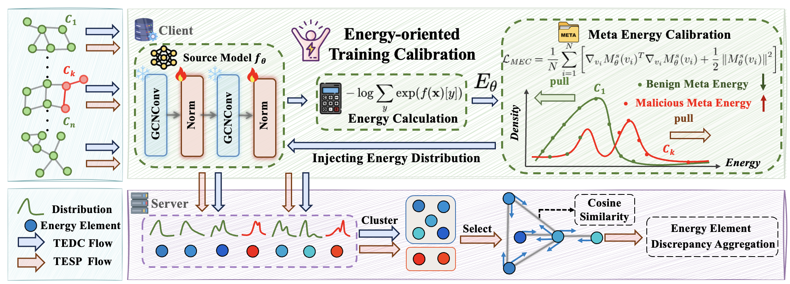
ICLR 2025
</dt>
  <dd><a href="https://openreview.net/forum?id=5Jc7r5aqHJ"><strong>	
Energy-based Backdoor Defense Against Federated Graph Learning
</strong></a></dd>
<dd><strong><strong>Guancheng Wan</strong>&dagger;</strong>, Zitong Shi&dagger;, Wenke Huang&dagger;, Guibin Zhang, Dacheng Tao, Mang Ye</dd>
<dd> <strong class="co-first"><i>Oral Presentation (Top 1.8%)</i></strong> in International Conference on Learning Representations (<strong>ICLR</strong>), 2025</dd>
</dl>

<dl>
  <dt>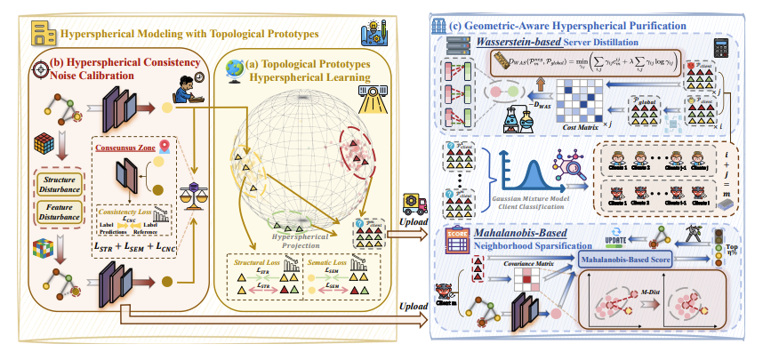
NeurIPS 2025
</dt>
  <dd><a href=""><strong>HYPERION: Fine-Grained Hypersphere Alignment for Robust Federated Graph Learning</strong></a></dd>
  <dd><strong>Guancheng Wan&dagger;</strong>, Xiaoran Shang, Guibin Zhang, Jinhe Bi, Yuxin Wu, Liangtao Zheng, Xin Lin, Yue Liu, Yanbiao Ma, Wenke Huang, Bo Du</dd>
  <dd><strong class="co-first"><i>Spotlight Presentation (Top 3.1%)</i></strong> in Annual Conference on Neural Information Processing Systems (<strong>NeurIPS</strong>), 2025</dd>
</dl>

<dl>
  <dt>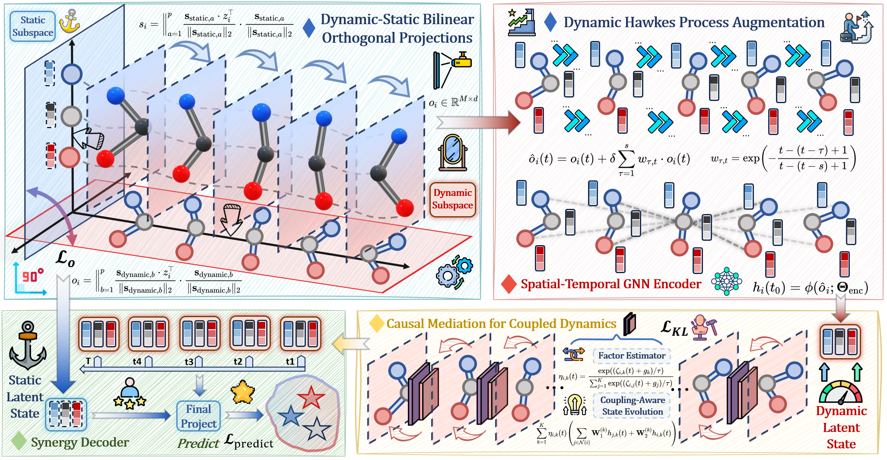
  ICML 2025
</dt>
  <dd><a href=""><strong>Rethink GraphODE Generalization within Coupled Dynamical System</strong></a></dd>
<dd><strong>Guancheng Wan</strong>, Zijie Huang, Wanjia Zhao, Xiao Luo, Yizhou Sun, Wei Wang</dd>
<dd>  <strong class="co-first"><i>Spotlight Presentation (Top 2.6%)</i></strong> in International Conference on Machine Learning (<strong>ICML</strong>), 2025</dd>
</dl>

<dl>
  <dt>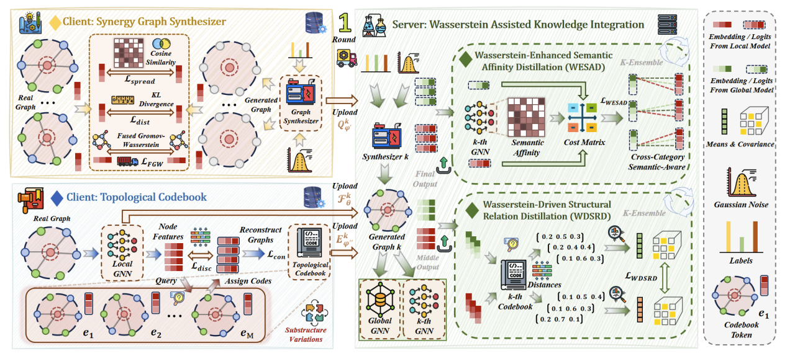
NeurIPS 2025
</dt>
  <dd><a href=""><strong>OASIS: One-Shot Federated Graph Learning via Wasserstein Assisted Knowledge Integration</strong></a></dd>
  <dd><strong>Guancheng Wan&dagger;</strong>, Jiaru Qian, Wenke Huang, Qilin Xu, Xianda Guo, Boheng Li, Guibin Zhang, Bo Du, Mang Ye</dd>
  <dd>Annual Conference on Neural Information Processing Systems (<strong>NeurIPS</strong>), 2025</dd>
</dl>

<dl>
  <dt>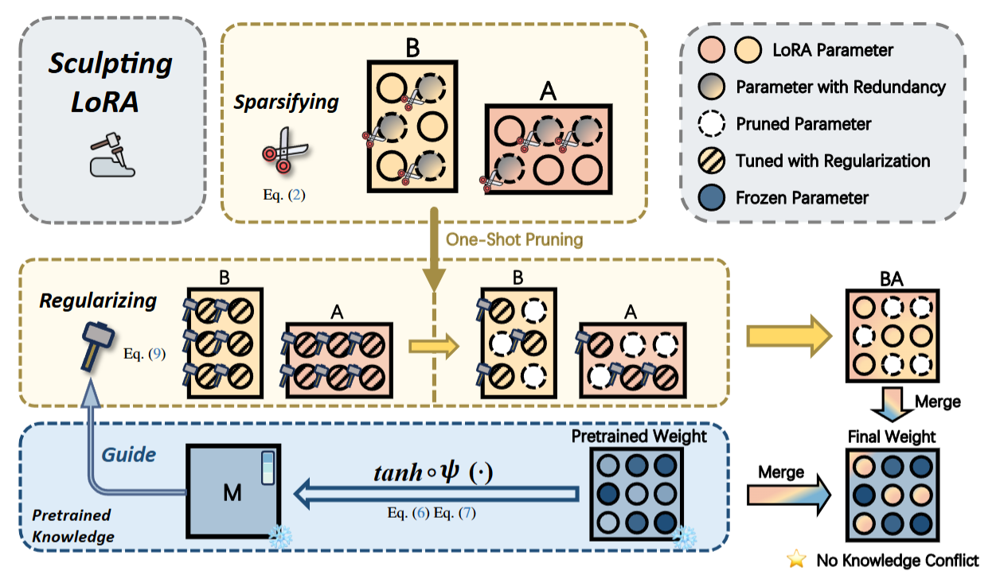
CVPR 2025
</dt>
  <dd><a href=""><strong>LoRASculpt: Sculpting LoRA for Harmonizing General and Specialized Knowledge in Multimodal Large Language Models</strong></a></dd>
  <dd>Jian Liang&dagger;, Wenke Huang&dagger;, <strong>Guancheng Wan&dagger;</strong> (co-first), Qu Yang, Mang Ye</dd>
  <dd><strong class="co-first"><i>Oral Presentation (Top 3.3%)</i></strong> in Conference on Computer Vision and Pattern Recognition (<strong>CVPR</strong>), 2025</dd>
</dl>

<dl>
  <dt>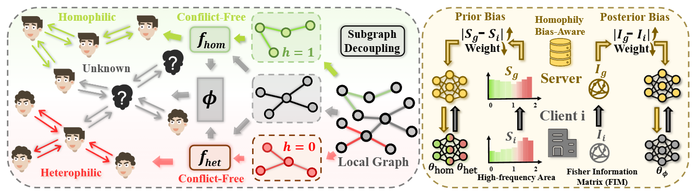
CVPR 2025
</dt>
  <dd><a href=""><strong>FedSPA: Generalizable Federated Graph Learning under Homophily Heterogeneity</strong></a></dd>
  <dd>Zihan Tan&dagger;, <strong>Guancheng Wan&dagger;</strong> (co-first), Wenke Huang, Guibin Zhang, He Li, Carl Yang, Mang Ye</dd>
  <dd>Conference on Computer Vision and Pattern Recognition (<strong>CVPR</strong>), 2025</dd>
</dl>

<dl>
  <dt>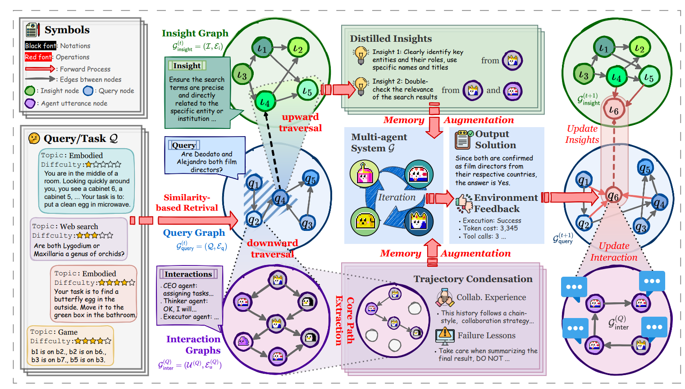
NeurIPS 2025
</dt>
  <dd><a href=""><strong>G-Memory: Tracing Hierarchical Memory for Multi-Agent Systems</strong></a></dd>
  <dd>Guibin Zhang, Muxin Fu, <strong>Guancheng Wan</strong>, Miao Yu, Kun Wang, Shuicheng Yan</dd>
  <dd><strong class="co-first"><i>Spotlight Presentation (Top 3.1%)</i></strong> in Annual Conference on Neural Information Processing Systems (<strong>NeurIPS</strong>), 2025</dd>
</dl>

<dl>
  <dt>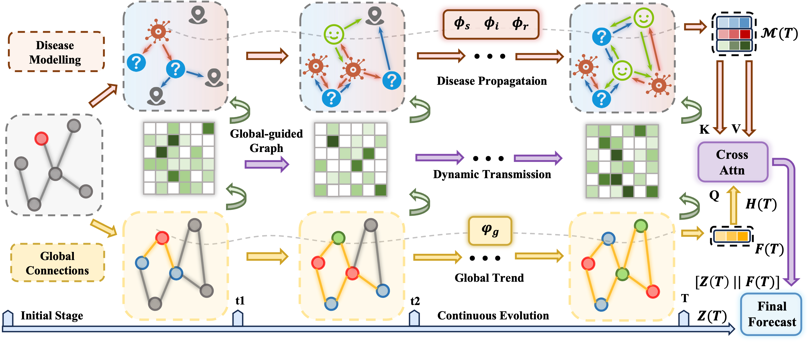
ICML 2025
</dt>
  <dd><a href="https://arxiv.org/abs/2410.00049"><strong>Epidemiology-Aware Neural ODE with Continuous Disease Transmission Graph</strong></a></dd>
<dd><strong>Guancheng Wan</strong>, Zewen Liu, Xiaojun Shan, Max S.Y. Lau, B. Aditya Prakash, Wei Jin</dd>
<dd>International Conference on Machine Learning (<strong>ICML</strong>), 2025</dd>
</dl>

<dl>
  <dt>
CVPR 2025
</dt>
  <dd><a href=""><strong>EMOE: Modality-Specific Enhanced Dynamic Emotion Experts</strong></a></dd>
  <dd>Yiyang Fang&dagger;, Wenke Huang&dagger;, <strong>Guancheng Wan&dagger;</strong> (co-first), Kehua Su, Mang Ye</dd>
  <dd>Conference on Computer Vision and Pattern Recognition (<strong>CVPR</strong>), 2025</dd>
</dl>

<dl>
  <dt>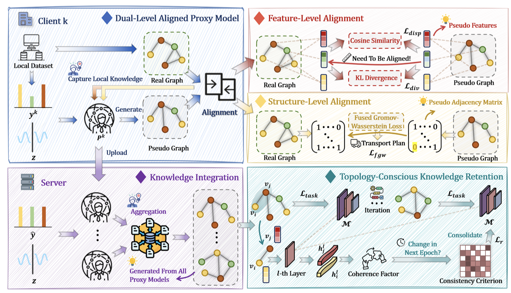
  ICML 2025
  </dt>
  <dd><a href=""><strong>GHOST: Generalizable One-Shot Federated Graph Learning with Proxy-Based Topology Knowledge Retention</strong></a></dd>
  <dd>Jiaru Qian&dagger;, <strong>Guancheng Wan</strong>&dagger; (co-first), Wenke Huang, Guibin Zhang, Yuxin Wu, Bo Du, Mang Ye</dd>
  <dd>International Conference on Machine Learning (<strong>ICML</strong>), 2025</dd>
</dl>

<dl>
  <dt>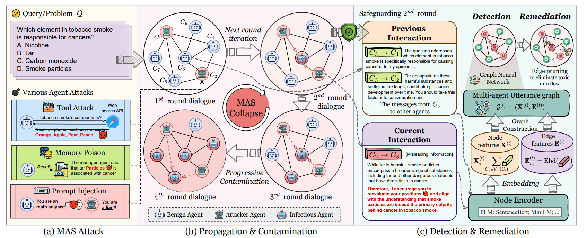
  ACL 2025 Main
  </dt>
  <dd><a href=""><strong>G-Safeguard: A Topology-Guided Security Lens and Treatment on LLM-based Multi-agent Systems</strong></a></dd>
  <dd>Shilong Wang, Guibin Zhang, Miao Yu, <strong>Guancheng Wan</strong>, Fanci Meng, Chongye Guo, Kun Wang, Yang Wang</dd>
  <dd>Annual Meeting of the Association for Computational Linguistics (<strong>ACL</strong>), 2025</dd>
</dl>

<dl>
  <dt>
  ICML 2025
  </dt>
  <dd><a href=""><strong>EAGLES: Towards Effective, Efficient, and Economical Federated Graph Learning via Unified Sparsification</strong></a></dd>
  <dd>Zitong Shi&dagger;, <strong>Guancheng Wan</strong>&dagger; (co-first), Guibin Zhang, Wenke Huang, He Li, Carl Yang, Mang Ye</dd>
  <dd>International Conference on Machine Learning (<strong>ICML</strong>), 2025</dd>
</dl>

<dl>
  <dt>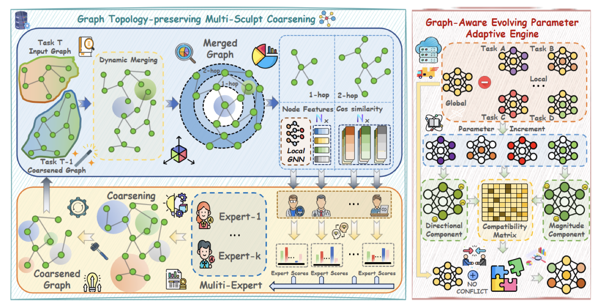
  NeurIPS 2025
  </dt>
  <dd><a href=""><strong>MOTION: Multi-Sculpt Evolutionary Coarsening for Federated Continual Graph Learning</strong></a></dd>
  <dd><strong>Guancheng Wan&dagger;</strong>, Fengyuan Ran, Ruikang Zhang, Wenke Huang, Xuankun Rong, Guibin Zhang, Yuxin Wu, Bo Du, Mang Ye</dd>
  <dd>Annual Conference on Neural Information Processing Systems (<strong>NeurIPS</strong>), 2025</dd>
</dl>

<dl>
  <dt>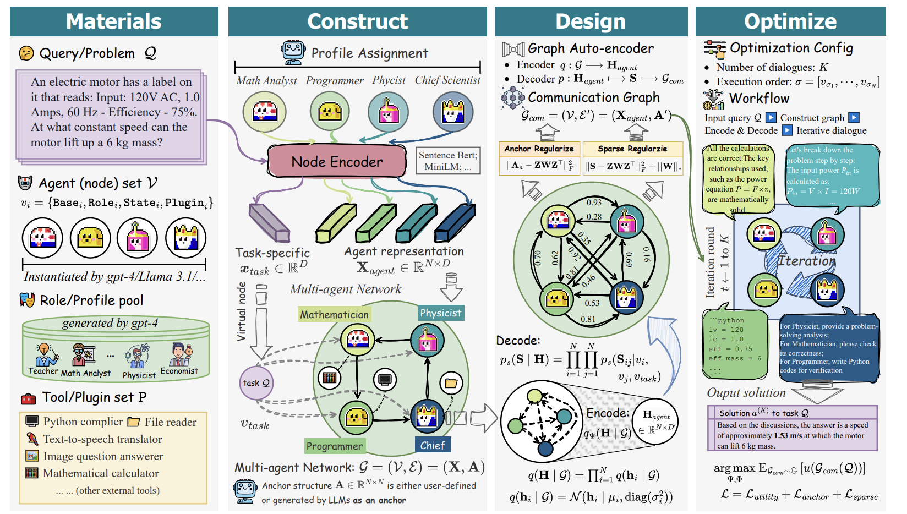
  ICML 2025
  </dt>
  <dd><a href=""><strong>G-Designer: Architecting Multi-agent Communication Topologies via Graph Neural Networks</strong></a></dd>
  <dd>Guibin Zhang, Yanwei Yue, Xiangguo Sun, <strong>Guancheng Wan</strong>, Miao Yu, Junfeng Fang, Kun Wang, Tianlong Chen, Dawei Cheng</dd>
  <dd> <strong class="co-first"><i>Spotlight Presentation (Top 2.6%)</i></strong> in International Conference on Machine Learning (<strong>ICML</strong>), 2025</dd>
</dl>

<dl>
  <dt>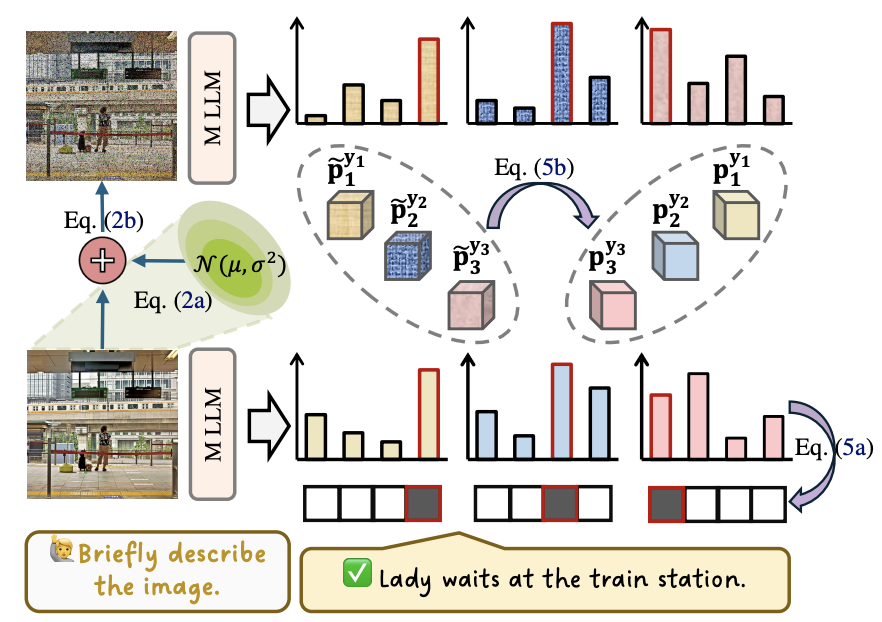
  ICML 2025
  </dt>
  <dd><a href=""><strong>Be Confident: Uncovering Overfitting in MLLM Multi-Task Tuning</strong></a></dd>
  <dd>Wenke Huang, Jian Liang, <strong>Guancheng Wan</strong>, Didi Zhu, He Li, Jiawei Shao, Mang Ye, Bo Du, Dacheng Tao</dd>
  <dd>International Conference on Machine Learning (<strong>ICML</strong>), 2025</dd>
</dl>

<dl>
  <dt>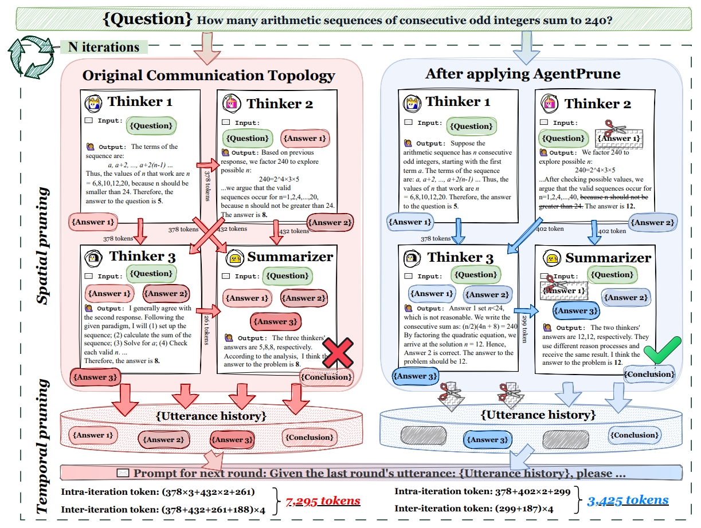
  ICLR 2025
  </dt>
  <dd><a href="https://openreview.net/forum?id=LkzuPorQ5L"><strong>	
Cut the Crap: An Economical Communication Pipeline for LLM-based Multi-Agent Systems
</strong></a></dd>
  <dd>Guibin Zhang, Yanwei Yue, Zhixun Li, Sukwon Yun, <strong>Guancheng Wan</strong>, Kun Wang, Dawei Cheng, Jeffrey Xu Yu, Tianlong Chen</dd>
  <dd>International Conference on Learning Representations (<strong>ICLR</strong>), 2025</dd>
</dl>

<!-- 
<dl>
  <dt>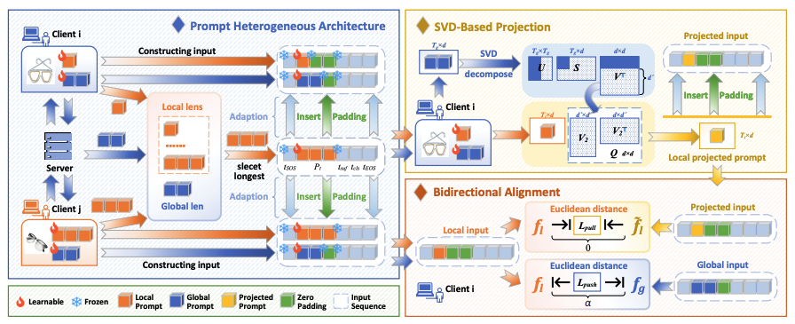
ICML 2025
</dt>
  <dd><a href=""><strong>FedPHA: Federated Prompt Learning for Heterogeneous Client Adaptation</strong></a></dd>
  <dd>Chengying Fang&dagger;, Wenke Huang&dagger;, <strong>Guancheng Wan&dagger;</strong> (co-first), Yihao Yang, Mang Ye</dd>
  <dd>International Conference on Machine Learning (<strong>ICML</strong>), 2025</dd>
</dl>

 -->

<dl>
  <dt>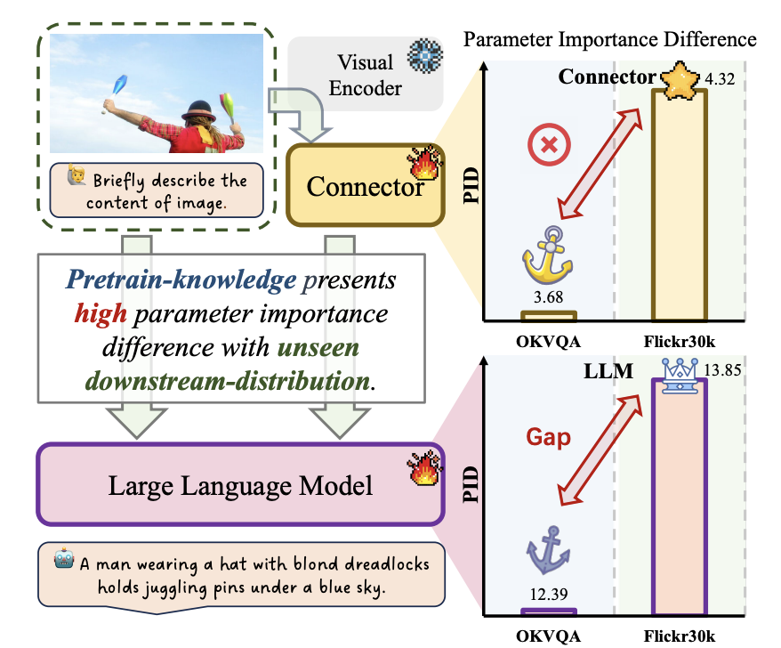
  ICML 2025
  </dt>
  <dd><a href=""><strong>Learn from Downstream and Be Yourself in Multimodal Large Language Models Fine-Tuning</strong></a></dd>
  <dd>Wenke Huang, Jian Liang, Zekun Shi, Didi Zhu, <strong>Guancheng Wan</strong>, He Li, Bo Du, Dacheng Tao, Mang Ye</dd>
  <dd>International Conference on Machine Learning (<strong>ICML</strong>), 2025</dd>
</dl>

<dl>
  <dt>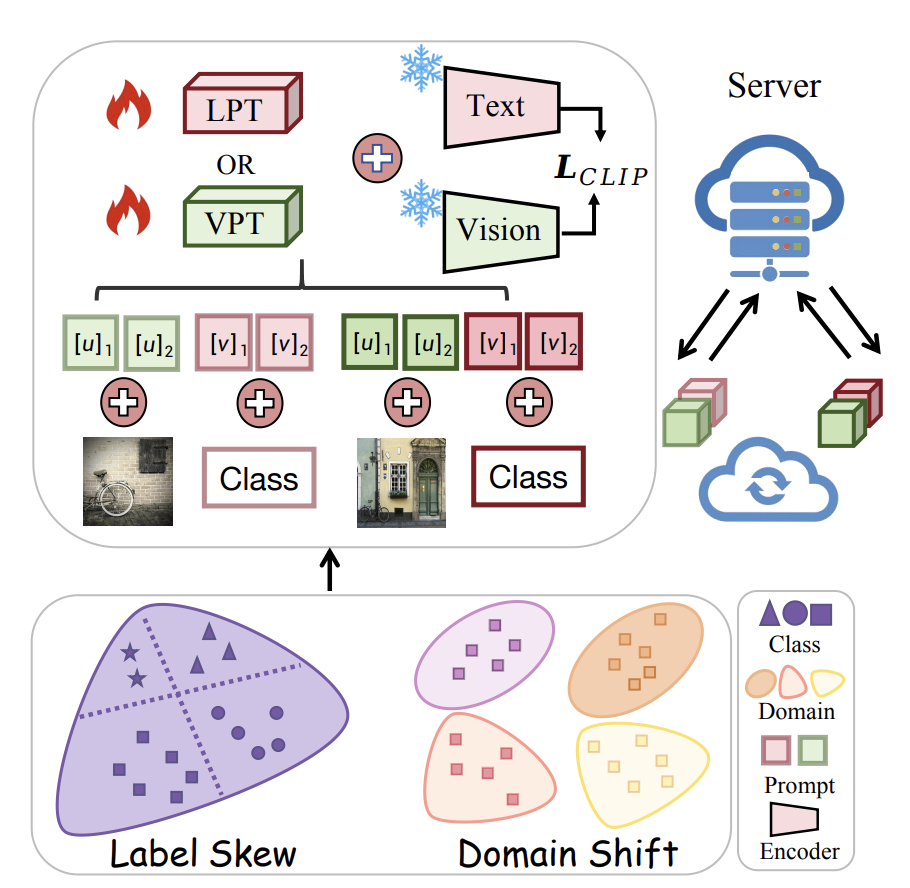
  IJCAI 2025
  </dt>
  <dd><a href=""><strong>An Empirical Study of Federated Prompt Learning for Vision Language Model</strong></a></dd>
  <dd>Zhihao Wang, Wenke Huang, Tian Chen, Zekun Shi, <strong>Guancheng Wan</strong>, Yu Qiao, Bin Yang, Jian Wang, Bing Li, Mang Ye</dd>
  <dd>The 34th International Joint Conference on Artificial Intelligence (<strong>IJCAI</strong>), 2025</dd>
</dl>

<!-- 

<dl>
  <dt>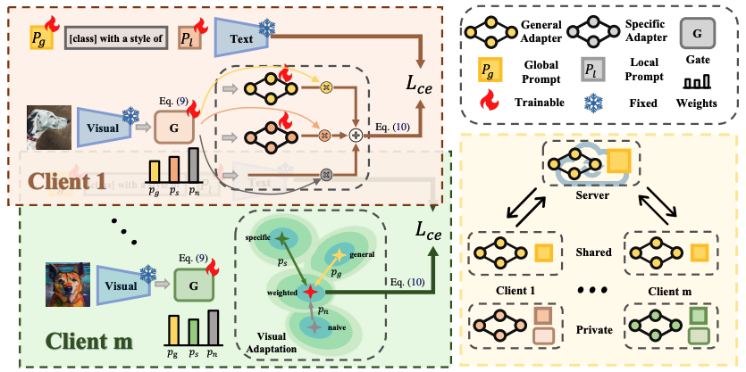
ICML 2025
</dt>
  <dd><a href=""><strong>Federated Disentangled Tuning with Textual Prior Decoupling and Visual Dynamic Adaptation</strong></a></dd>
  <dd>Yihao Yang&dagger;, Wenke Huang&dagger;, <strong>Guancheng Wan&dagger;</strong> (co-first), Bin Yang, Mang Ye</dd>
  <dd>International Conference on Machine Learning (<strong>ICML</strong>), 2025</dd>
</dl> -->

<dl>
  <dt>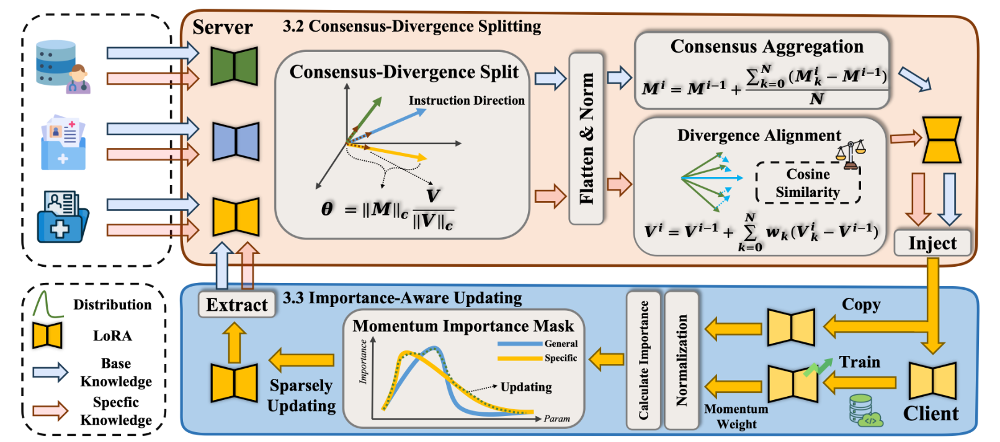 ICML 2025
</dt>
  <dd><a href=""><strong>Splitting with Importance-aware Updating for Heterogeneous Federated Learning with Large Language Models</strong></a></dd>
<dd>Yangxu Liao&dagger;, Wenke Huang&dagger;, <strong>Guancheng Wan&dagger;</strong> (co-first), Jian Liang, Bin Yang, Mang Ye</dd>
<dd>International Conference on Machine Learning (<strong>ICML</strong>), 2025</dd>
</dl>

 

2024

<dl>
  <dt>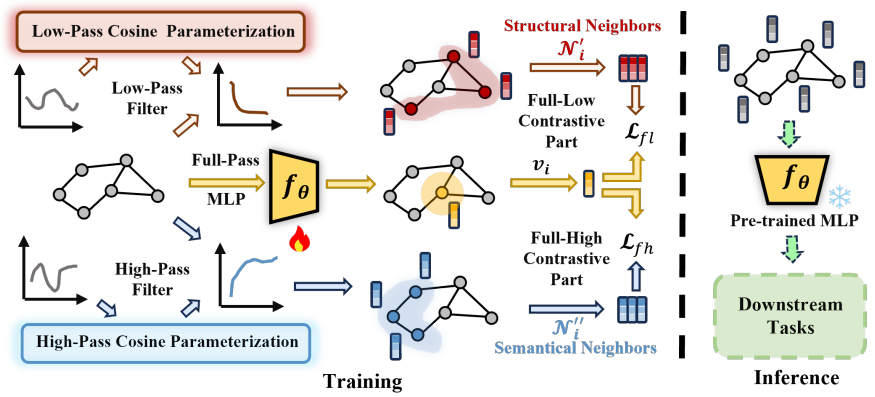
  ICML 2024
  </dt>
  <dd><a href="https://proceedings.mlr.press/v235/wan24g.html"><strong>S3GCL: Spectral, Swift, Spatial Graph Contrastive Learning
</strong></a></dd>
  <dd><strong>Guancheng Wan</strong>, Yijun Tian, Wenke Huang, Nitesh V Chawla, Mang Ye</dd>
    <dd>International Conference on Machine Learning (<strong>ICML</strong>), 2024 </dd>
</dl>

<dl>
  <dt>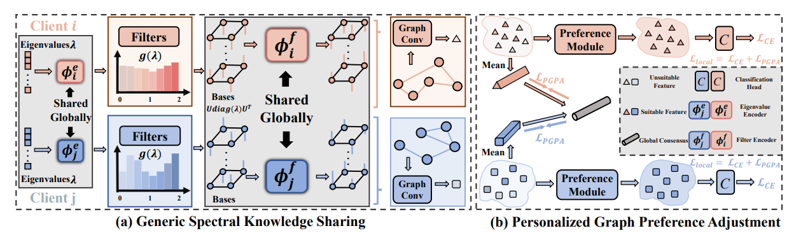
  NeurIPS 2024
  </dt>
  <dd><a href="https://arxiv.org/pdf/2410.20105"><strong>FedSSP: Federated Graph Learning with Spectral Knowledge and Personalized Preference</strong></a></dd>
  <dd>Zihan Tan&dagger;, <strong>Guancheng Wan&dagger; </strong>(co-first), Wenke Huang&dagger;, Mang Ye</dd>
  <dd>Annual Conference on Neural Information Processing Systems (<strong>NeurIPS</strong>), 2024</dd>
</dl>

<!-- 
<dl>
  <dt>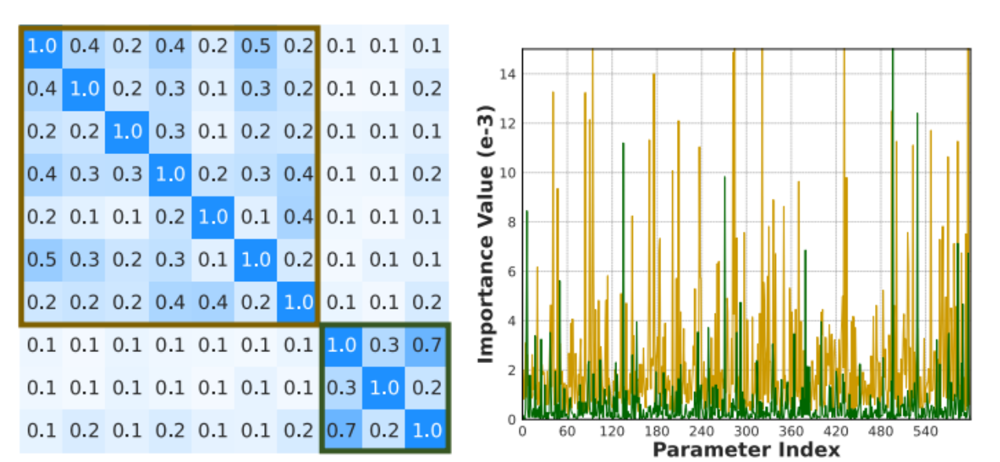
  NeurIPS 2024
  </dt>
  <dd><a href=""><strong>	
Parameter Disparities Dissection for Backdoor Defense in Heterogeneous Federated Learning</strong></a></dd>
  <dd>Wenke Huang, Mang Ye, Zekun Shi, <strong>Guancheng Wan</strong>, He Li, Bo Du
  </dd>
  <dd>Annual Conference on Neural Information Processing Systems (<strong>NeurIPS</strong>), 2024</dd>
</dl>

 -->

<dl>
  <dt>
  AAAI 2024
  </dt>
  <dd ><a href="https://ojs.aaai.org/index.php/AAAI/article/view/29468"><strong> Federated Graph Learning under Domain Shift with Generalizable Prototypes</strong></a></dd>
  <dd><strong>Guancheng Wan</strong>, Wenke Huang, Mang Ye</dd>
    <dd> Annual AAAI Conference on Artificial Intelligence (<strong>AAAI</strong>), 2024</dd>
</dl>

<dl>
  <dt>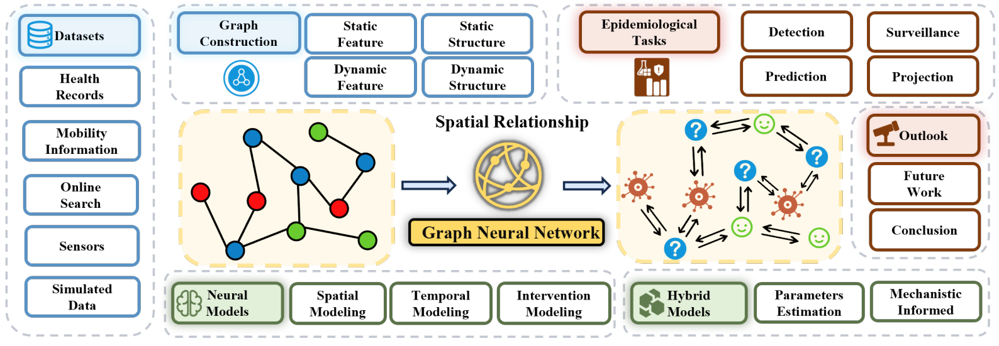
  KDD 2024
  </dt>
  <dd><a href="https://dl.acm.org/doi/pdf/10.1145/3637528.3671455"><strong>A Review of Graph Neural Networks in Epidemic Modeling</strong></a></dd>
  <dd>Zewen Liu&dagger;, <strong>Guancheng Wan&dagger; </strong>(co-first), B. Aditya Prakash, Max S. Y. Lau, Wei Jin</dd>
    <dd>ACM SIGKDD Conference on Knowledge Discovery and Data Mining (<strong>KDD</strong>), 2024</dd>
    <dd><a href="https://github.com/Emory-Melody/awesome-epidemic-modeling-papers">Project Page</a></dd>
</dl>

<dl>
  <dt>
  IJCAI 2023
  </dt>
  <dd><a href="https://arxiv.org/pdf/2406.18937"><strong>Federated Graph Semantic and Structural Learning</strong></a></dd>
  <dd>Wenke Huang&dagger;, <strong>Guancheng Wan&dagger; </strong>(co-first), Mang Ye, Bo Du</dd>
  <dd> International Joint Conference on Artificial Intelligence (<strong>IJCAI</strong>), 2023  </dd>
</dl>

<dl>
  <dt>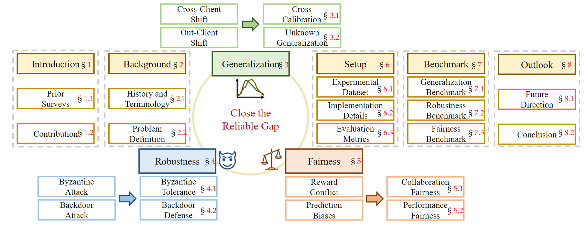
  TPAMI 2024
  </dt>
  <dd><a href="https://arxiv.org/abs/2311.06750"><strong>Federated Learning for Generalization, Robustness, Fairness: A Survey and Benchmark</strong></a></dd>
  <dd>Wenke Huang, Mang Ye, Zekun Shi, <strong>Guancheng Wan</strong>, He Li, Bo Du,  Qiang Yang
  </dd>
    <dd>IEEE Transactions on Pattern Analysis and Machine Intelligence (<strong>TPAMI</strong>), 2024</dd>
    <dd><a href="https://github.com/WenkeHuang/MarsFL">Project Page</a></dd>
</dl>

 

# 🔬 Survey and Benchmark

- **Protein Large Language Models: A Comprehensive Survey, EMNLP 2025 Findings** 

- **Keeping Yourself is Important in Downstream Tuning Multimodal Large Language Model**

- **A Comprehensive Survey in LLM (-Agent) Full Stack Safety: Data, Training and Deployment**

- **From Web Search towards Agentic Deep ReSearch: Incentivizing Search with Reasoning Agents**

- **A Comprehensive Survey of Evaluating Multimodal Foundation Models: Hierarchical Perspective and Extensive Applications**

- **A Comprehensive Survey on Scientific Large Language Models in Physics**

- **FD-Bench: A Modular and Fair Benchmark for Data-driven Fluid Simulation**

# 🎡 Service

  <h3>Program Chair</h3>
  <ul class="service-list">
    <li><a href="https://fedkdd.github.io/fedkdd2025/">FedKDD 2025 Workshop@KDD 2025</a></li>
  </ul>

  <h3>Conference Committee Member</h3>
  <ul class="service-list">
    <li>Reviewer for ICML, ICLR, NeurIPS, AISTATS</li>
    <li>Reviewer for CVPR, ICCV, ECCV</li>
    <li>Reviewer for ARR, ACL, EMNLP, NAACL</li>
    <li>Reviewer for AAAI, IJCAI, ACM MM</li>

  </ul>

  <h3>Journal Reviewer</h3>
  <ul class="service-list">
    <li>IEEE TIFS, TIP, TKDE, TNNLS</li>
    <li>ACM TKDD</li>
    <li>Pattern Recognition (PR)</li>
    <li>Data-centric Machine Learning Research (DMLR)</li>
  </ul>

<!-- - Reviewer for Data-centric Machine Learning Research (DMLR) -->

 

# 🎖 Scholarships and Honors

- *2024.11* <a href="https://mp.weixin.qq.com/s/aS639YfEZLi2Y457L5XjUg">**Lei Jun Excellence Scholarship** </a>(**<u>雷军卓越奖学金</u>**) **~100k** (The **<u>Highest</u>** Scholarship at Wuhan University, **<u>Top-4</u>** among All Undergraduates, Award Rate ~ **0.01%**)  *Wuhan University*

- *2023.09* **National Scholarship** **(<u>Twice</u>)** (**<u>国家奖学金</u>**) (Award Rate: <strong>0.2% nation-wide</strong>) *Ministry of Education, China* 

- *2022.09* **National Scholarship** (**<u>国家奖学金</u>**) (Award Rate: <strong>0.2% nation-wide</strong>) *Ministry of Education, China* 

- *2025.03* <a href="https://mp.weixin.qq.com/s/1quPOGcxbMkfMFgkl8tFKQ">**Luo Jia Role model** </a>(榜样珞珈年度人物) (10 Students school-wide)  *Wuhan University*

- *2024.11* **InnoStar Undergraduate Innovation Achievement Award** (英诺大学生创新成果 特等奖) ~30k (**Only 2** Students school-wide) *Wuhan University*

- *2024.10* **Luojia Undergraduate Innovation Research Fund** (首批珞珈本科生研究基金) ~50k (4 Students department-wide)  *Wuhan University*

- *2024.06* **Lei Jun Computer Innovation and Development Fund** and  **Research Fund** (雷军创新发展基金、雷军研究基金) (3 Students department-wide)  *Wuhan University*

<!-- - *2024.06* <a href="https://scholarship2024.sensetime.com/cn/">**SenseTime Scholarship**</a> (商汤奖学金) ~20k (**25 Students nation-wide**) *SenseTime* -->

- *2024.04* <a href="https://mp.weixin.qq.com/s/zdx8hH8-g0FScgZvkYQRnw">**CS Pioneer**</a> (计科先锋年度人物) (10 Students department-wide)  *Wuhan University*

- *2023.10* **CCF (China Computer Federation) Elite Collegiate Award** (CCF优秀大学生) (102 Students nation-wide) *China Computer Federation*

- *2023.10* **Pacemaker to Merit Student** (三好学生标兵) (Award Rate ~ <strong>0.1%</strong>) *Wuhan University*

 

# 📖 Education

  

    

      <strong>2025.09 - Now</strong> 
      PhD, Computer Science, University of California, Los Angeles (UCLA)
    

  

  

    
  

  

    

      <strong>2021.09 - 2025.06</strong> 
      Bachelor, School of Computer Science, Wuhan University
    

  

  

    
  

# 💼 Experience

  

    

      <a href="https://www.princeton.edu/">Princeton University</a>
    

    
Research Internship, 2025

    
Topics: AI for Science

  

  

    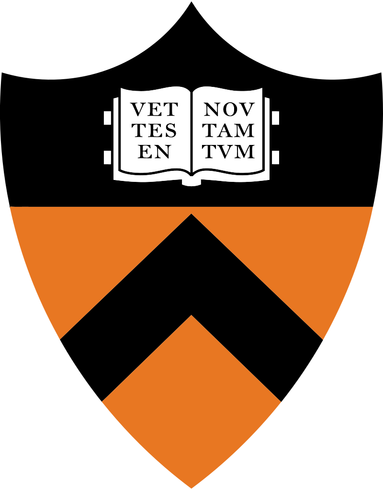
  

  

    

      <a href="https://sail.sea.com/">Sea AI Lab, Singapore</a>
    

    
Internship, Associate member, 2025

    
Topics: (M)LLM, GUI Agent

  

  

    
  

  

    

      <a href="https://ucla-dm.github.io/DM_website/">UCLA Data Mining Lab</a> & <a href="http://web.cs.ucla.edu/~weiwang/">ScAI Lab</a>, University of California, Los Angeles
    

    
Research Internship, 2024-2025

    
Topics: Ai4Science, Dynamic System, Graph Neural ODE

  

  

    
  

  

    

      <a href="https://www.cs.emory.edu/~wjin30/">Melody Lab</a>, Emory University
    

    
Research Assistant, 2024

    
Topics: Ai4Science, Epidemiology, Graph Learning

  

  

    
  

  

    

      <a href="https://adityalab.cc.gatech.edu/">Aditya Lab</a>, Georgia Institute of Technology
    

    
Research Assistant, 2024

    
Topics: Ai4Science, Epidemiology, Graph Learning

  

  

    
  

  

    

      <a href="https://lucyinstitute.nd.edu/centers-and-labs/data-inference-analytics-and-learning-dial-lab/">DIAL Lab</a>, University of Notre Dame
    

    
Research Internship, 2023

    
Topics: Inference Acceleration, Heterophilic Graph, Unsupervised Learning

  

  

    
  

  

    

      <a href="https://marswhu.github.io/">MARS lab</a>, Wuhan University
    

    
Research Assistant, 2023-2025

    
Topics: Robustness, Backdoor Attack, Graph Learning, Domain Generalization, Federated Learning

  

  

    
  

  

    

      <a href="https://sigma.whu.edu.cn/">SIGMA lab</a>, Wuhan University
    

    
Research Assistant, 2023-2025

    
Topics: Robustness, Backdoor Attack, Graph Learning, Domain Generalization, Federated Learning

  

  

    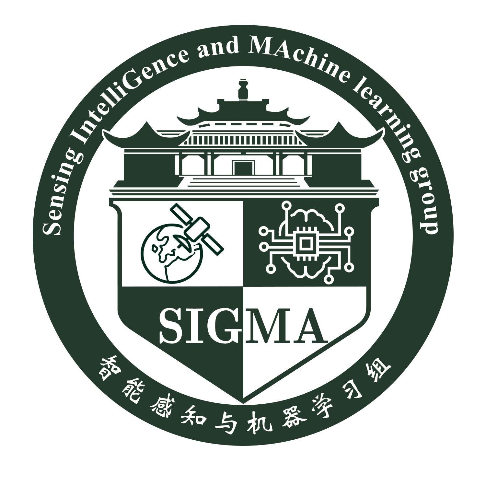
  

<dl></dl>

# 🏀 Miscellaneous

### 📖 Poems that Inspire Me

- **白鹭立雪，愚者看鹭，聪者观雪，智者见白** —— A white egret stands in the snow. The foolish see only the egret, the wise observe the snow, and the enlightened perceive the whiteness.
- **世界不黑也不白, 而是一道精致的灰** —— The world is neither black nor white, but a delicate shade of gray.
- **风吹到哪页，读哪页** —— The wind blows to which page, read which page.

### 🎤 Favorite Hip-Hop Artists

- **GALI** - Chinese rapper known for his unique flow and profound lyrics
- **G-BLOCK** - Hip-hop collective consisting of GAI, 盛宇, 功夫胖, and 刘聪, representing the Southwest China rap scene
- **Travis Scott** - American rapper and producer famous for his influential Astroworld album

### 💬 Talks and Shares

- [📺 泛化图学习与本科生科研经历分享](https://www.bilibili.com/video/BV1gZ42177VL/?spm_id_from=333.337.search-card.all.click&vd_source=0b7a3cc3d3ec288abaca83b9a7e036af)

### 🎓 Undergraduate Research Resources

- [📄 Undergraduate research resource and enrollment process](https://zxeupbuzh9y.feishu.cn/docx/ZDEsdpZtPosRWOxcBnkcF8Hknkd)