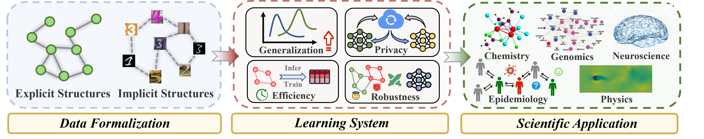
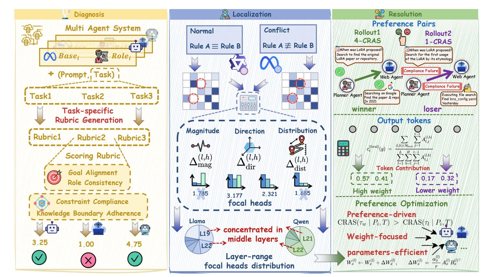
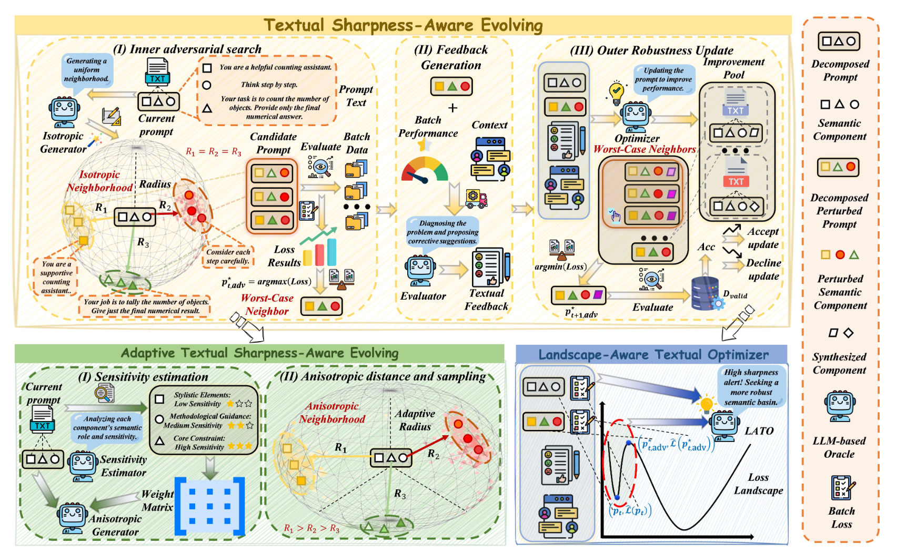
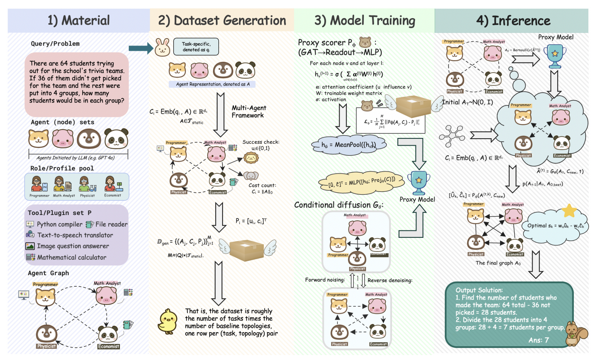
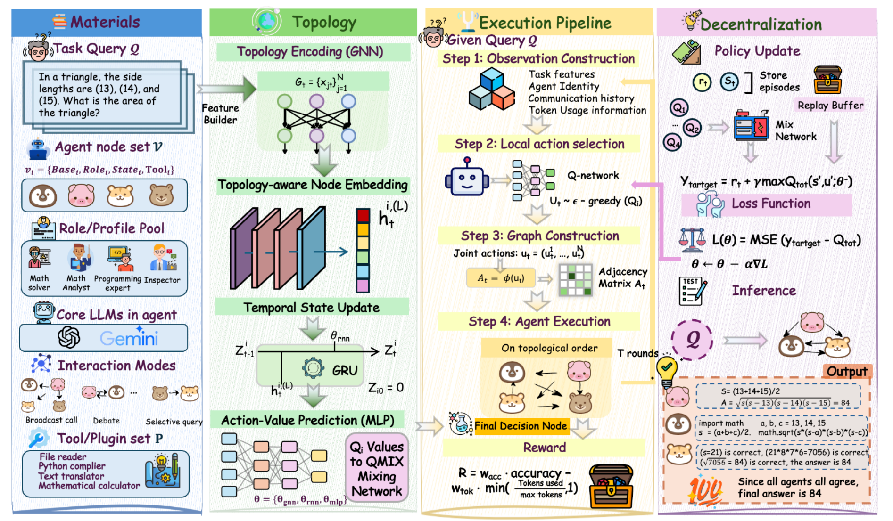
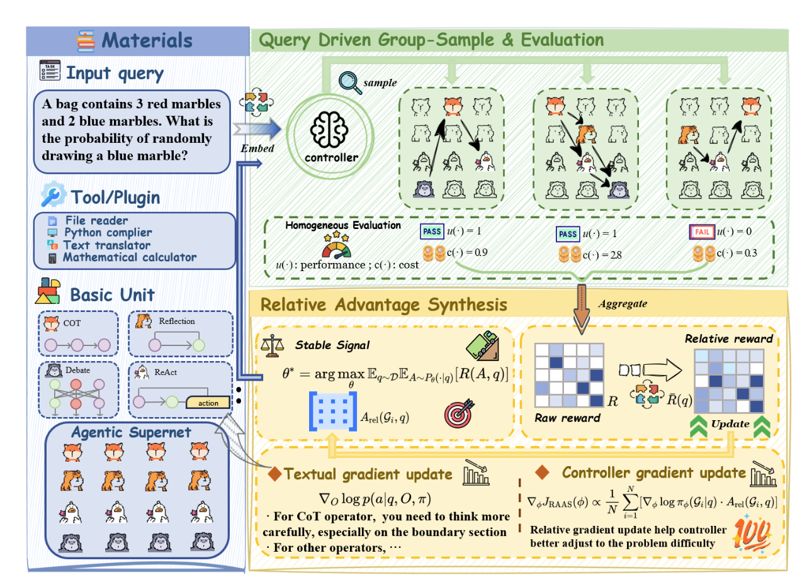
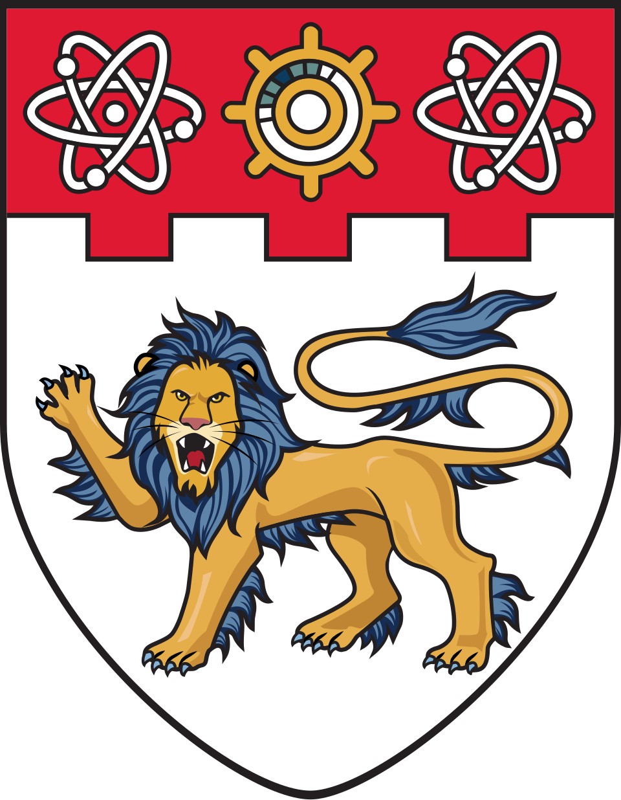
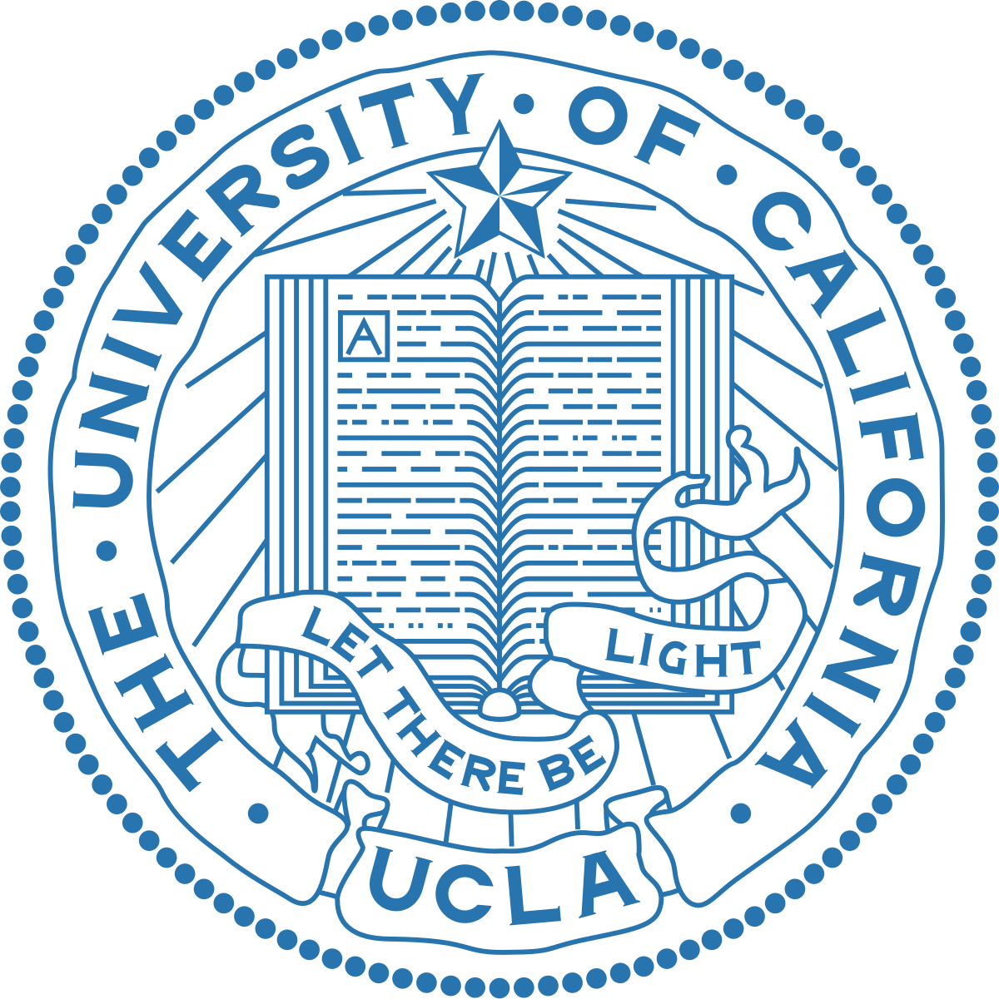
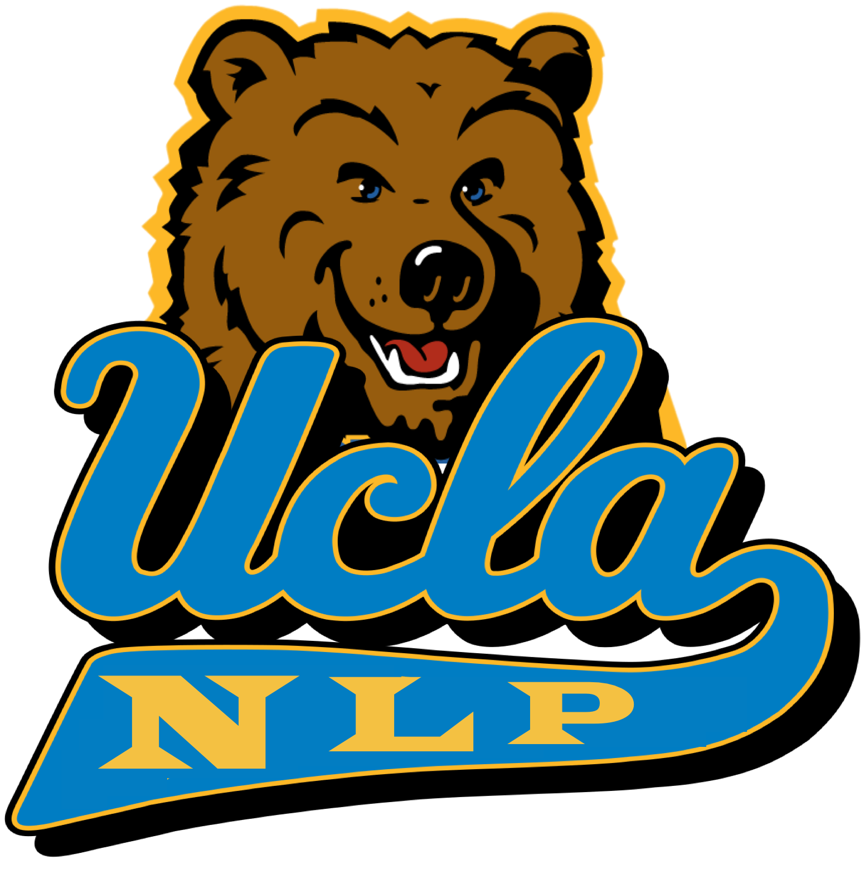








Hi there! My name is Levina Mengting Li, a first year Ph.D. student at Nanyang Technological University ([NTU](https://www.ntu.edu.sg/)), where I am fortunate to be advided by [Prof.Siqiang Luo](https://scholar.google.com/citations?user=ZDwbMg4AAAAJ&hl=zh-CN) and [Prof. Han Yu](https://scholar.google.com/citations?user=eXgoTXMAAAAJ&hl=en). Prior to joining NTU, I received my Bachelor's degree at University of California, Los Angeles ([UCLA](https://www.ucla.edu/)), while I was doing research supervised by [Prof. Kai-Wei Chang](https://scholar.google.com/citations?user=fqDBtzYAAAAJ&hl=zh-CN)  and [Prof. Ying Nian Wu](https://scholar.google.com/citations?user=7k_1QFIAAAAJ&hl=zh-CN&oi=ao), working closely with [Eric Hanchen Jiang](https://ericjiang18.github.io/).

<!-- 

  

 -->

<!-- 

  

  
 <strong style="color: red">🌟 📢 Seeking for Remote Intern/Assistant (RA)</strong> 
We are looking for motivated research interns to work together! Almost every intern who worked with me has published papers at top conferences such as ICML, NeurIPS, ICLR and CVPR. If you are interested, please don't hesitate to contact me via <a href="mailto:gcwan03@ucla.edu">Email</a> or <a 
href="https://guanchengwan.github.io/images/wechat.png">WeChat</a>.
  

 -->

# 🔎 Research 
<!-- "All things are interconnected, this is the essence of nature."  -->

<!-- <dt style="text-align: center; margin: 0; padding: 0;">
  
</dt> -->

My current research interests focus on these key areas: 

a) World Models

b) AI for Science/Biology

<!-- 

# 🔥 News

<ul style="list-style-type: none; padding-left: 0; margin: 0;">
  <li><em>2025.09.20:</em> 🎉 Several papers were accepted by <strong>NeurIPS 2025</strong> with <strong class="co-first"> Two Spotlights (Top 3.1%)</strong>. See you in San Diego!</li>
  <li><em>2025.09:</em> 🎉 One paper was accepted by <strong>EMNLP 2025 Findings</strong>. Thanks to all collaborators!</li>
  <li><em>2025.05:</em> 🎉 Two papers were accepted by <strong>ACL 2025 Main</strong>. Thanks to all collaborators!</li>
  <li><em>2025.05:</em> 🎉 Some papers were accepted by <strong>ICML 2025</strong> with <strong class="co-first"> Two Spotlights (Top 2.6%)</strong>. See you in Vancouver!</li>
   <li><em>2024.11:</em> 🫡 Serve as Associate <strong>Program Chair</strong> for <a href="https://fedkdd.github.io/fedkdd2025/">FedKDD 2025@KDD</a> - Welcome to submit!</li>
  <li><em>2025.04:</em> 🎉 One co-first authored paper: LoRASculpt was selected as an <strong class="co-first">Oral Presentation (Top 3.3%)</strong> at <strong>CVPR 2025</strong>. Thanks to all collaborators!</li>
  <li><em>2025.03:</em> 🎉 One co-first authored paper: FedTGE was selected as an <strong class="co-first">Oral Presentation (Top 1.8%)</strong> at <strong>ICLR 2025</strong>. Thanks to all collaborators!</li>
  <li><em>2025.02:</em> 🎉 Three papers accepted by <strong>CVPR 2025</strong> on fine-tuning and applications of <strong>Multimodal Large Language Models (MLLM)</strong>. Thanks to all collaborators! See you in Nashville.</li>
  <li><em>2024.02:</em> I serve as a reviewer for <strong>NeurIPS 2025</strong>.</li>
  <li><em>2024.02:</em> 🎉 Honored to receive Graduate Research Fellowship from <strong>UCLA</strong> and <strong>UIUC</strong>.</li>
  <li><em>2025.01:</em> 🎉 Two papers were accepted by <strong>ICLR 2025</strong>. See you in Singapore.</li>
  <li><em>2024.12:</em> 🎉 One paper was accepted by <strong>AAAI 2025</strong>.</li>
  <li><em>2024.12:</em> I serve as a reviewer for <strong>ICML 2025</strong>.</li>
  <li><em>2024.11:</em> 🎈I was honored with <strong>Lei Jun Excellence Scholarship</strong> ~ <strong>100k</strong> (The <strong><u>Highest</u></strong> Scholarship at Wuhan University, <strong><u>Top-4</u></strong> among All Undergraduates, Award Rate ~ <strong>0.01%</strong>)</li>
  <li><em>2024.11:</em> I serve as a reviewer for <strong>CVPR 2025</strong>.</li>
  <li><em>2024.09:</em> 🎉 Two papers were accepted by <strong>NeurIPS 2024</strong>. See you in Vancouver.</li>
  <li><em>2024.08:</em> Organize a tutorial at <strong>KDD 2024</strong> in Barcelona on 25th, come if you are interested in epidemics + GNN!</li>
  <li><em>2024.08:</em> I serve as a reviewer for <strong>ICLR 2025</strong>.</li>
  <li><em>2024.06:</em> 🎉 One paper is accepted by <strong>TPAMI</strong>, congrats to all collaborators!</li>
  <li><em>2024.05:</em> I serve as a reviewer for <strong>NeurIPS 2024</strong>.</li>
  <li><em>2024.05:</em> 🎉 Our survey about GNNs in Epidemic Modeling is accepted by <strong>KDD 2024</strong>. See you in Barcelona!</li>
  <li><em>2024.05:</em> 🎉 One paper about self-supervised graph learning was accepted by <strong>ICML 2024</strong>. See you in Austria!</li>
  <li><em>2024.04:</em> 🚀 Explore our pre-print: a deep look at using Graph Neural Networks in Epidemic Modeling. Check our collected <a href="https://github.com/Emory-Melody/awesome-epidemic-modeling-papers">paper list</a>.</li>
  <li><em>2024.02:</em> I serve as a reviewer for <strong>ACM MM 2024</strong>.</li>
  <li><em>2024.02:</em> I serve as a reviewer for <strong>ECCV 2024</strong>.</li>
  <li><em>2023.12:</em> A paper was accepted to <strong>AAAI 2024</strong>. See you in Vancouver.</li>
  <li><em>2023.11:</em> I serve as a reviewer for <strong>CVPR 2024</strong>.</li>
  <li><em>2023.11:</em> 🚀 We thoroughly explore three core research areas in federated learning: generalization, robustness, and fairness. Don't hesitate to utilize our <a href="https://github.com/WenkeHuang/MarsFL">benchmarking codes</a> for your own research goal!</li>
  <li><em>2023.10:</em> I attended China National Computer Congress (CNCC) and was awarded the honor of CCF (China Computer Federation) Elite Collegiate Award (102 Students nation-wide).</li>
  <li><em>2023.10:</em> I won the National Scholarship for the second time (0.2% nation-wide), and was selected the Pacemaker to Merit Student (Award Rate: 60/59774=0.1%).</li>
  <li><em>2023.08:</em> we attended <em>the 32nd international joint conference on artificial intelligence (<strong>ijcai</strong>)</em> and presented our work in macao.</li>
</ul>

 

 -->

<!-- 

# 📝 Manuscripts

<dl>
  <dt>
Arxiv
</dt>
  <dd><a href="https://arxiv.org/pdf/2509.23188"><strong>Diagnose, Localize, Align: A Full-Stack Framework for Reliable LLM Multi-Agent Systems under Instruction Conflicts</strong></a></dd>
<dd>Arxiv: 2509.23188</dd>
</dl>

<dl>
  <dt>
Arxiv
</dt>
  <dd><a href="https://arxiv.org/pdf/2509.24130"><strong>Beyond Magic Words: Sharpness-Aware Prompt Evolving for Robust Large Language Models with TARE</strong></a></dd>
<dd>Arxiv: 2509.24130</dd>
</dl>

 

 -->

# 📃 Publications

**&dagger; Equal Contribution (Co-first listed in random order)**   

<dl>
  <dt>
</dt>
  <dd><a href="https://arxiv.org/abs/2510.07799"><strong>	
GTD: Dynamic Generation of Multi LLM Agents Communication Topologies with Graph Diffusion Models
</strong></a></dd>
<dd>Eric Hanchen Jiang&dagger;, <strong>Mengting Li&dagger;</strong>, Guancheng Wan;, Sophia Yin;,  Yuchen Wu, Xiao Liang, Xinfeng Li, Yizhou Sun, Wei Wang, Kai-Wei Chang, Ying Nian Wu</dd>
<dd> Accepted to <strong>ACL ARR</strong>, 2026</dd>
</dl>

<dl>
  <dt>

</dt>
<dd>
  <a href="https://arxiv.org/abs/2604.00344" target="_blank" rel="noopener noreferrer">
    <strong>Agent Q-Mix: Selecting the Right Action for LLM Multi-Agent Systems through Reinforcement Learning</strong>
  </a>
</dd>
<dd>
  Eric Hanchen Jiang&dagger;, <strong>Levina Li&dagger;</strong>, Rui Sun, Xiao Liang, Yubei Li, Yuchen Wu, Haozheng Luo, Hengli Li, Zhi Zhang, Zhaolu Kang, Kai-Wei Chang, Ying Nian Wu.
</dd>
<dd>
  Submitted to <strong>COLM</strong>, 2026
</dd>

</dl>

<dl>
  <dt>

</dt>
<dd>
  <a href="https://openreview.net/forum?id=swDl4wdwix&referrer=%5BAuthor%20Console%5D(%2Fgroup%3Fid%3DAAAI.org%2F2026%2FWorkshop%2FAABA4ET%2FAuthors%23your-submissions)" target="_blank" rel="noopener noreferrer">
    <strong>
      RAAS: LLM Agentic System Architecture Search with GRPO
    </strong>
  </a>
</dd>
<dd>
   Jiayi Yang&dagger;, Guancheng Wan&dagger; <strong>Mengting Li&dagger;</strong>, Wnke Huang, Jinhe Bi, Han Zhang, Eric Hanchen Jiang, Yizhou Sun, Wei Wange
</dd>
<dd>
  Accepted to <strong>AAAI 2026</strong> @ Agentic AI Benchmarks and Applications for Enterprise Tasks
</dd>

</dl>

<dl>
  <dd><a href=""><strong> 
Evaluating Evidence of Sociodemographic Bias Within and Across Large Language Models In A Mental Health Support Setting
</strong></a></dd>
<dd><strong>Levina Li</strong></dd>
<dd> Internal research report at Cedars-Sinai Clinical Research Team, 2026</dd>
</dl>

 

# 🎖 Scholarships and Honors

- *2026* <a href="https://www.ntu.edu.sg/admissions/graduate/financialmatters/scholarships/npgs">**Nanyang President's Graduate Scholarship** </a>  *NTU*

- *2025* <a href="https://ucla.academicworks.com/opportunities/119805">**S & S Scholarship Fund** </a>  *UCLA*

- *2024* <a href="https://ucla.academicworks.com/opportunities/119805">**S & S Scholarship Fund** </a>  *UCLA*

 

# 📖 Education

  

    

      <strong>Expected Graduation: Spring 2030</strong> 
      Ph.D. Student, College of Computing and Data Science, Nanyang Technological University (NTU)
    

  

  

    
  

  

    

      <strong>Graduated: Winter 2026</strong> 
      Undergraduate, Statistics & Data Science, University of California, Los Angeles (UCLA)
    

  

  

    
  

# 💼 Experience

  

    

    <a href="https://web.cs.ucla.edu/~kwchang/">UCLA NLP Group</a>, University of California, Los Angeles
    

    
Research Assistant, 2025

    
Topics: LLM, LLM Agents

  

  

    
  

  

    

      <a href="https://www.cedars-sinai.org/home.html">Cedars-Sinai Medical Center</a>, Los Angeles
    

    
Research Assistant, 2024-2025

    
Topics: AI for Healthcare

  

  

    
  

  

    

      

        <a href="http://www.stat.ucla.edu/~ywu/research.html">Ying Nian Wu's Lab</a>, University of California, Los Angeles
      

      
Research Assistant, 2024-2025

      
Topics: LLM, LLM Agents, Graph Learning

    

  

    
  

  

  

    

      <a href="https://www.mit.edu/">Massachusetts Institute of Technology (MIT)</a>, Cambridge, Massachusetts
    

    
Machine Learning Researcher (Intern), 2023.07 - 2023.08

    
Topics: RF, LR, XGBoost; Benchmarking

    
Highlights: Directed a 4-person data science team

  

  

    
  

<dl></dl>

<!-- 
# 🐰 Miscellaneous

### 📖 Poems that Inspire Me

- **白鹭立雪，愚者看鹭，聪者观雪，智者见白** —— A white egret stands in the snow. The foolish see only the egret, the wise observe the snow, and the enlightened perceive the whiteness.
- **世界不黑也不白, 而是一道精致的灰** —— The world is neither black nor white, but a delicate shade of gray.
- **风吹到哪页，读哪页** —— The wind blows to which page, read which page.  -->
